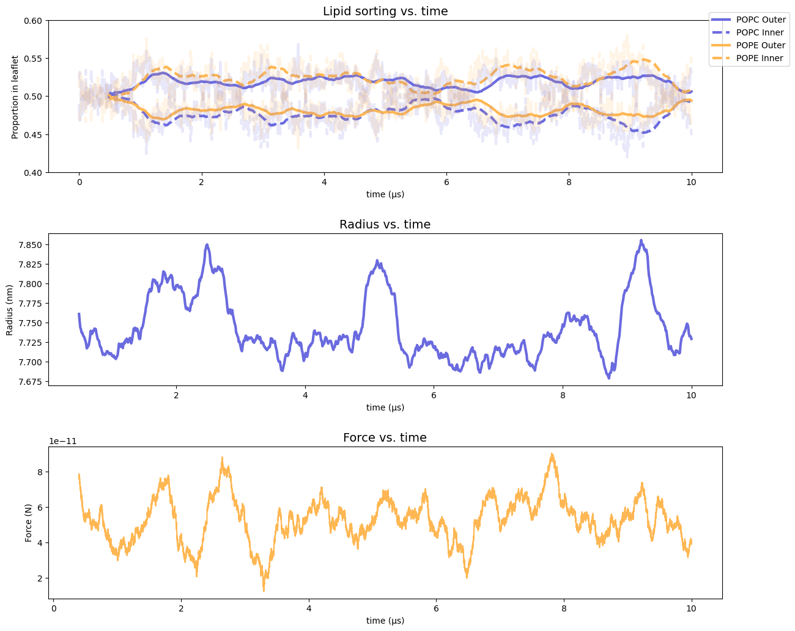

# LIPID SORTING IN TUBULES


[![Powered by MDAnalysis](https://img.shields.io/badge/powered%20by-MDAnalysis-orange.svg?logoWidth=16&logo=data:image/x-icon;base64,AAABAAEAEBAAAAEAIAAoBAAAFgAAACgAAAAQAAAAIAAAAAEAIAAAAAAAAAAAAAAAAAAAAAAAAAAAAAAAAAAAAAAAAJD+XwCY/fEAkf3uAJf97wGT/a+HfHaoiIWE7n9/f+6Hh4fvgICAjwAAAAAAAAAAAAAAAAAAAAAAAAAAAAAAAACT/yYAlP//AJ///wCg//8JjvOchXly1oaGhv+Ghob/j4+P/39/f3IAAAAAAAAAAAAAAAAAAAAAAAAAAAAAAAAAAAAAAJH8aQCY/8wAkv2kfY+elJ6al/yVlZX7iIiI8H9/f7h/f38UAAAAAAAAAAAAAAAAAAAAAAAAAAB/f38egYF/noqAebF8gYaagnx3oFpUUtZpaWr/WFhY8zo6OmT///8BAAAAAAAAAAAAAAAAAAAAAAAAAAAAAAAAgICAn46Ojv+Hh4b/jouJ/4iGhfcAAADnAAAA/wAAAP8AAADIAAAAAwCj/zIAnf2VAJD/PAAAAAAAAAAAAAAAAICAgNGHh4f/gICA/4SEhP+Xl5f/AwMD/wAAAP8AAAD/AAAA/wAAAB8Aov9/ALr//wCS/Z0AAAAAAAAAAAAAAACBgYGOjo6O/4mJif+Pj4//iYmJ/wAAAOAAAAD+AAAA/wAAAP8AAABhAP7+FgCi/38Axf4fAAAAAAAAAAAAAAAAiIiID4GBgYKCgoKogoB+fYSEgZhgYGDZXl5e/m9vb/9ISEjpEBAQxw8AAFQAAAAAAAAANQAAADcAAAAAAAAAAAAAAAAAAAAAAAAAAAAAAAAAAAAAjo6Mb5iYmP+cnJz/jY2N95CQkO4pKSn/AAAA7gAAAP0AAAD7AAAAhgAAAAEAAAAAAAAAAACL/gsAkv2uAJX/QQAAAAB9fX3egoKC/4CAgP+NjY3/c3Nz+wAAAP8AAAD/AAAA/wAAAPUAAAAcAAAAAAAAAAAAnP4NAJL9rgCR/0YAAAAAfX19w4ODg/98fHz/i4uL/4qKivwAAAD/AAAA/wAAAP8AAAD1AAAAGwAAAAAAAAAAAAAAAAAAAAAAAAAAAAAAALGxsVyqqqr/mpqa/6mpqf9KSUn/AAAA5QAAAPkAAAD5AAAAhQAAAAEAAAAAAAAAAAAAAAAAAAAAAAAAAAAAADkUFBSuZ2dn/3V1df8uLi7bAAAATgBGfyQAAAA2AAAAMwAAAAAAAAAAAAAAAAAAAAAAAAAAAAAAAAAAAB0AAADoAAAA/wAAAP8AAAD/AAAAWgC3/2AAnv3eAJ/+dgAAAAAAAAAAAAAAAAAAAAAAAAAAAAAAAAAAAAAAAAA9AAAA/wAAAP8AAAD/AAAA/wAKDzEAnP3WAKn//wCS/OgAf/8MAAAAAAAAAAAAAAAAAAAAAAAAAAAAAAAAAAAAIQAAANwAAADtAAAA7QAAAMAAABUMAJn9gwCe/e0Aj/2LAP//AQAAAAAAAAAA)](https://www.mdanalysis.org)
[](https://GitHub.com/Naereen/StrapDown.js/graphs/commit-activity)


## Introduction
Coming soon! Once this gets published, I can write more here :)

## What is in this Repository?
The pipeline to set up tubules is based on TS2CG. Contained in this repository
is a fork of a setup pipeline which can be used to generate tubules of desired size and 
composition.

Contained in the folder src/ is a modules file in python called pore_modules.py.
In here, you can find all the required functions to create a pore, update the GROMACS topology, and generate a .gro file for position restraints. Following creation of this file, the .itp file itself will need to be modified, which is the only step which requires any serious user intervention. An entire, worked example is provided in the [tutorial](#tutorial), along with all possible input and output files.

Following generation of all of these files, you will be ready to run a production run. Depending on the system size, these can take considerable amounts of time to run, especially locally. Use of dedicated computing resources such as a cluster or supercomputer are desireable, however if they are inaccessible, consider sticking to smaller systems and shorter simulations. 

Once the production run has completed, you will need to run the analysis. The resulting files will be saved as a .csv, after which you can visualise these. All relevant modules can be found in /src/analysis_modules.py.

process_trajectories.py is the example script used to run the analysis on one or several systems; here, showing the exact commands used to process the systems from the publication. It is recommended to remove water from the .gro and trajectory files.

Figures/ contains various renders of each system, as well as the tcl scripts used to generate these in vmd.

example_results/ contains output files for all of the systems studied in the book chapter.

---
# TUTORIAL
The following protocol will allow you to generate *your own* tubules from scratch - all you know is your desired composition, and nothing else. You can follow the exact steps in the tutorial, for which the files are included; or, you can change the composition of the tubule yourself, and try your own system. The protocol remains the same.

If you end up using this tutorial, you should cite our book chapter (coming soon) and also TS2CG, the paper for which is found [here](https://rdcu.be/drEQr): 

You will need: 
- Access to a terminal
- This repository; run ```git clone --recurse-submodules https://github.com/MoMS-MMSB/lipid_sorting.git``` in a terminal. We call recurse-submodules as this project uses another repository we developed based on [TS2CG](https://github.com/marrink-lab/TS2CG1.1) to help with the initial tubule setup.
- A conda environment for this repository. This gives you access to the in-house scripts generated for setup and analysis, and all their required python package dependencies. Notably, this includes Nextflow, the software used to run the workflow for initial structure generation. This is done by running ```conda env create --name lipid-sorting --file=environment.yml```
- [TS2CG](https://github.com/marrink-lab/TS2CG1.1). Clone the repository (`git clone https://github.com/marrink-lab/TS2CG1.1.git`)into this tutorial folder, then cd into it and run ./compile.sh. Once that has finished, move the **PCG** program into the folder TS2CG-Setup-Pipeline/
- A working GROMACS install. This entire process was developed using GROMACS/2023.1, the installation instructions for which can be found [here](https://manual.gromacs.org/documentation/2023.1/install-guide/index.html)

Once you've cloned the repository and created the environment, we can begin. Activate the conda environment:
 ```
 conda activate lipid-sorting
 ```

You can also run all of this by running `bash setup_env.sh` after cloning the environment.

## 1. Initial setup with TS2CG pipeline
Create a new folder, and enter. For this tutorial, we will call this folder 1.initial/

Create a file called `generate.str`, which will contain all the important information the creation of your tubule.

Here's an example I used to create the simple POPC/POPE lipid mixtures with a radius of 10nm and length of 10nm, specified in the book chapter as the system with reduced cost. We will use this system for the sake of the tutorial, as it is probably the easiest to run on most machines, and yields results the "fastest"

```
[Lipids List]
Domain 0
POPC    0.5  0.5   0.70
POPE    0.5  0.5   0.70
End

[Shape Data]
ShapeType Cylinder
Box 30 30 10
Thickness 2
Radius 10
End
```

We can then run the nextflow pipeline, by running:


```
nextflow run ../../TS2CG-Setup-Pipeline/main.nf 
```

Based on your system and computer, the time taken can vary. The benefit of nextflow is that if any one step returns an error, it will at which steo the error occurred, and can even be resumed from the prior step by adding ```--resume``` to the command line call once the errors have been resolved.

After the workflow has run, files named "eq.gro", "index.ndx", and "topol.top" will be generated in the results/ subfolder of 1.initial/

## 2. Equilibrate (without pores)

Go up one level and make a new folder; 2.eq_nopore/

In the corresponding tutorial file, you will find an .mdp file to run the first "proper" equilibration. The example here is for 500ns, and will most definitely require a cluster of sorts. 

Run the gromacs pre-processing function gmx grompp:

```
gmx grompp -f eq-nopore.mdp -c ../1.initial/results/eq.gro -p ../1.initial/results/topol.top -n ../1.initial/results/index.ndx -o eq_nopore.tpr
```

Run the system however you can, eventually yielding "eq_nopore.gro". An example gro file has been provided in the relevant tutorial files, for those who simply wish to follow the process without running the actual simulations (a smart idea!)

## 3. Generate the pores
Let's make a new folder, 3.create_pore/

As outlined in the chapter, pores are *really* permitted via (i) their initial creation and (ii) holding them open in subsequent simulations using flat-bottomed potentials.

### **i)** Create pores
In the respective tutorial folder is a script, generate_pores.py. If you haven't already, enter into this new folder. Then run:

```
python create_pore.py -c ../2.eq_nopore/eq_nopore.gro -o create_pore_x.gro --axis x --radius 2.5 -p ../1.initial/results/topol.top -po modified_x.top --residues POPC POPE

python create_pore.py -c create_pore_x.gro -o create_pore_xy.gro --axis y --radius 2.5 -p modified_x.top -po modified_xy.top --restraints --residues POPC POPE
```

We're first generating a pore in the x- dimension, then in the y-dimension; both with radius 2.5nm. Since we're not specifying coordinates (done with the command line flag --coords), they'll automatically be set to the middle of the box - here, at 14.799, 14.799, and 05.000 for x, y, and z, respectively.

One last thing for the sake of being tidy is to use the GROMACS ```gmx editconf``` command to renumber the residues in the new gro file we've just created. Since creation of pores deletes residues and reorganises them in the gro file, naturally the gro file will be slightly unordered - this isn't necessarily a problem, but for the sake of being tidy we should run:

```
gmx editconf -f create_pore_xy.gro -resnr 1 -o init.gro
```

And with that, we have our starting structure!

We also need to quickly make an index file so that we can later do seperate temperature coupling for the membrane and solvent. Run the following command:
```
gmx make_ndx -f init.gro << EOF
del 0-9
r POPC POPE
r W
name 0 Membrane
name 1 Solvent
q
EOF
```

### **ii)** Define flat-bottomed potentials
The definition of flat-bottomed potentials (FBPs) is the most hands-on step (and potentially, the most tedious...) of the entire process.

In order to activate an FBP in GROMACS, three steps are required:

1) Creation of a restraints.gro file (which we have just done), which defines the **geometric center of the FBP**
2) Modification of the molecule's topology file to define the **shape, size and force** of the FBP
3) Actually activating the FBP during the molecular dynamics run, by defining a flag in the .mdp file.

A more in-depth explanation on restraints files is found in [S1.](#s1-restraints-file)
In saying that, a comparison of our structure file ```init.gro```, our restraints file ```restraints.gro```, and the knowledge that we have defined the center of restraint for all pores as being the center of the box at 14.799, 14.799, and 05.000, should it rather clear what we are doing.

Modification of the .itp file needs to occur on a system-by-system basis, and occurs based on the FBP requirements for a given system. Included here is an .itp which contains only the lipids POPC and POPE, with a section added:

```
#ifdef POSRES_PL
; Flat-bottomed position restraint for each PL
[ position_restraints ]
; numatoms  functype  g   r   k
;                       (nm) (kJ mol−1nm−2)
       05      2      6  -2.5   5000
       06      2      6  -2.5   5000
       07      2      6  -2.5   5000
       08      2      6  -2.5   5000
       09      2      6  -2.5   5000
       10      2      6  -2.5   5000
       11      2      6  -2.5   5000
       12      2      6  -2.5   5000
       05      2      7  -2.5   5000
       06      2      7  -2.5   5000
       07      2      7  -2.5   5000
       08      2      7  -2.5   5000
       09      2      7  -2.5   5000
       10      2      7  -2.5   5000
       11      2      7  -2.5   5000
       12      2      7  -2.5   5000
#endif
```
Here, we are defining an FBP with an "if" statement. This if statement activates the FBPs we define - two, here; one for each dimension in which we have pores.

For a longer explanation of this section, consult [S2.](#s2-fbps-in-the-topology-file), which explains each column.

We also need to reference the correct .itp in the system topology file, as opposed to the old one. Run:
```
cp modified_xy.top system.top
```
delete the line `#include "{some_path}/top/martini_v3.0.0_phospholipids_1.itp`

And replace it with `#include m3_POPC_POPE_pore.itp`
## 4. Perform production run, holding the pores open
Now, to run the full production run. Move up a level, and create a folder called 4.production/

Change into this folder. In the corresponding tutorial folder, you'll find an .mdp ready to run, which is a version similar to that used in the book chapter, named `c-rescale_prod_posres.mdp`.

Two things are extremely important here:
1) Line #20 `define                   = -DPOSRES_PL`; this is where we activate the FBP as defined in the .itp file with the if statement; it needs a "-D" added in front, so "POSRES" becomes "-DPOSRES".
2) Line #105 `compressibility          = 3e-4 0`. Since we are using semiisotropic pressure coupling, the first value (3e-4) is the compressibility in x and y, and the second (0) is the compressibility in z. By switching this to 0, the z-dimension is essentially fixed; since this is the direction in which our tubule is periodic, it fixes our tubule at desired length.

With the correct .mdp file, we're ready to run the production run with FBPs.

## 5. Run Analysis

Assuming your production run has complete, or you are simply following with the files provided, we are ready for the final step: analysis.

Many functions are provided in this repository, but the scripts in folder 5.analysis/ use the most important.

First, we need to process the data:

```
python process_trajectory.py -f ../4.production/production.xtc -s ../4.production/production.gro -e ../4.production/production.edr
```

This should only take a couple of minutes for this system. Here, we are taking three sources of input: the structure (.gro) file, the trajectory (.xtc/.trr) file, and the energy (.edr) file.

(Unfortunately, the .edr file is too big for GitHub... nonetheless, the outputs are included!)

It returns three .csv files: leaflets.csv, containing the information on the proportion of lipids per leaflets, radius.csv, showing the radius per trajectory frame, and force.csv, which calculates the contractive force along the tubule axis. 

Once it has completed, you can then run:

```
python sorting_figure.py
```

Which will return three plots, as seen here:


And with that, we're done! For more information about the code, please consult the modules themselves, under src/analysis_modules or src/pore_modules.

If you have any questions or feedback on this tutorial, or the code as a whole, please raise an issue on GitHub, or otherwise contact jackson.crowley@ibcp.fr

Thank you for following along!

## S1. Restraints file
The Restraints file is a .gro file almost identical to the input structure file, but the x/y/z coordinates of each molecule are replaced with the x/y/z coordinates of the geometric center of the restraint in which we are defining.

Consider our input structure file, in `Tutorial/3.create_pore/init.gro`:

```
Expect a large membrane in water
71260
    1POPC   NC3    1   8.872  23.737   6.103 -0.0577 -0.1469 -0.0486
    1POPC   PO4    2   8.643  24.027   5.954 -0.1412 -0.0939 -0.3024
    1POPC   GL1    3   8.601  23.762   5.640  0.4032  0.3497 -0.2360
    1POPC   GL2    4   8.358  23.640   5.834  0.2659  0.1622 -0.0877
    1POPC   C1A    5   8.837  23.397   5.617 -0.0925  0.1169 -0.0334
...
55606W        W71259  10.673  25.982   5.496  0.0510  0.0486 -0.2671
55607W        W71260  22.924  23.116   3.672  0.0720  0.0694 -0.1156
  29.59805  29.59805  10.00000
```
... and compare it to our corresponding restraints file in `Tutorial/3.create_pore/restraints.gro`:
```
Expect a large membrane in water
71260
    1POPC   NC3    1  14.799  14.799  05.000
    1POPC   PO4    2  14.799  14.799  05.000
    1POPC   GL1    3  14.799  14.799  05.000
    1POPC   GL2    4  14.799  14.799  05.000
    1POPC   C1A    5  14.799  14.799  05.000
...
55975W        W75687  10.673  25.982   5.496  0.0510  0.0486 -0.2671
55976W        W75688  22.924  23.116   3.672  0.0720  0.0694 -0.1156
  29.59805  29.59805  10.00000
```
You will notice that the last six columns of each line in the original file have been replaced with three in the restraints.gro file. In the original file, the first three of these columns are the x/y/z position of the corresponding atom, while the last three are the velocities in each direction (more information about GROMACS' (**very strict**) .gro file format can be found [here](https://manual.gromacs.org/archive/5.0.3/online/gro.html)).

In the restraints file, all we need are three values, the geometric center of the FBP *applied to that molecule*. Here, we define it as half the center of the box, for the sake of convenience (rounding to 3 decimal places to obey GROMACS' string formatting). Since we want to define a pore, we use the same geometry for all implicated molecules; in theory, one could be tricky here and set a different geometry for each, or several different geometries... but this is rather advanced, and not needed here.

FBPs are fickle, and can cause many problems, pretty much always due to user error (in my experience). This is understandable, since it requires manipulation of several files.

The reason we delete molecules in the earlier step is so that we can immediately apply an FBP with a very high force constant without crashing the system. If we hadn't deleted molecules, they would instead be subject to a FBP which immediately applies a large force constant, pushing them rapidly out of the pore region and almost certainly crashing the system.

> **If your system is crashing, I am willing to bet this is what is happening**. You have likely defined a flat bottom potential in a region where several atoms or molecules already are, and they are immediately accelerated out pf position. blowing up your simulation. The easiest way to understanding what is happening is to use software such as VMD to visualise your system, and understand where your FBP(s) lie, and see if any stray molecules may cause you any problems.
## S2. FBPs in the topology file
Consider this section in the topology file for both POPC and POPE:
```
#ifdef POSRES_PL
; Flat-bottomed position restraint for each PL
[ position_restraints ]
; numatoms  functype  g   r   k
;                       (nm) (kJ mol−1nm−2)
       05      2      6  -2.5   5000
       06      2      6  -2.5   5000
       07      2      6  -2.5   5000
       08      2      6  -2.5   5000
       09      2      6  -2.5   5000
       10      2      6  -2.5   5000
       11      2      6  -2.5   5000
       12      2      6  -2.5   5000
       05      2      7  -2.5   5000
       06      2      7  -2.5   5000
       07      2      7  -2.5   5000
       08      2      7  -2.5   5000
       09      2      7  -2.5   5000
       10      2      7  -2.5   5000
       11      2      7  -2.5   5000
       12      2      7  -2.5   5000
#endif

```
Here, column one denotes the bead/atom number to which the FBP is applied. Both POPC and POPE have 12 beads, but we don't apply the FBP to the first four, which correspond to the lipid heads; this is how we allow the lipids to sort via flip-flop.

The second column defines the function type: for ```[ position_restraints ]```, function type 2 refers to a FBP, simple!

The next column refers to the **geometry** of the FBP. You will notice that we are applying two types of FBP, then; one of type 6 and one of type 7. Type 6 refers to a cylinder which has it's length in the x-dimension, and type 7 is a cylinder with length in y. For more information about possible geomtries, consult the [GROMACS manual](https://manual.gromacs.org/current/reference-manual/functions/restraints.html#flat-bottomed-position-restraints).

The center of **both** of these tubules comes from the center of geometry defined on the particles in the ```restraints.gro``` file. 

> Again, in my experience, this is where things most often go wrong. If in doubt, make sure that every single instance of a molecule with FBPs defined has the restraint coordinates correctly specified in `restraints.gro`, and try to understand how they relate to the geomtry defined in the .itp!

The next column defines the **radius** of the FBP. Here, we're using `-2.5` - the minus sign denotes an **inverse** FBP, keeping all particles outside of the cylinder's radius, as opposed to inside.

Lastly, we have the column denoting the force constant k(kJ/mol^-1/nm^2), applied to any 